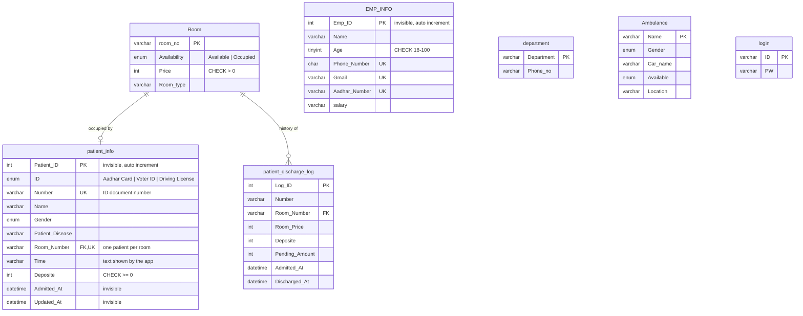

# Database Design: `hospital_management_system`

MySQL 8.0.23+ schema for the Java Swing Hospital Management System.
The full script is [`Hospital Management.sql`](Hospital%20Management.sql). It creates the database, tables, sample data, views, triggers and stored procedures in one run, and it can be run again safely.

## ER diagram



## What each feature does and why

| Feature | Where | Why |
|---|---|---|
| **Primary keys** | Every table | Each row can be identified, and InnoDB stores the table in primary-key order (clustered index). |
| **Surrogate vs natural keys** | `patient_info.Patient_ID`, `EMP_INFO.Emp_ID` (surrogate); `Number`, `Phone_Number`, `Gmail` (natural, `UNIQUE`) | Surrogate keys never change and keep joins small. Natural keys stay unique so the same person can't be entered twice. |
| **Invisible columns** (MySQL 8.0.23+) | `Patient_ID`, `Admitted_At`, `Updated_At`, `Emp_ID` | Adds IDs and audit timestamps without touching the Java code. `SELECT *` and `INSERT ... VALUES` without a column list both ignore them, so the schema changes and the app keeps working. |
| **Foreign keys** | `patient_info.Room_Number → Room.room_no`, `patient_discharge_log.Room_Number → Room.room_no` | Referential integrity: a patient can't be in a room that doesn't exist. `ON DELETE RESTRICT` stops deleting a room that is in use, and `ON UPDATE CASCADE` follows a room renumbering. |
| **UNIQUE constraint as a business rule** | `uq_patient_room (Room_Number)` | One bed holds one patient, and the database itself enforces it. |
| **CHECK constraints** | Price > 0, deposit ≥ 0, age 18–100, 10-digit phone (`REGEXP_LIKE`), email pattern, non-empty names | Bad data is rejected at the database, whatever client sends it. |
| **ENUM** | Gender, ID type, room and ambulance availability | A fixed list of allowed values that is stored compactly. |
| **NOT NULL + DEFAULT** | All columns | No unexpected NULLs; sensible defaults such as `'Available'` and `0`. |
| **Indexes** | `idx_room_availability`, `idx_patient_name`, `idx_log_discharged_at` | These match the app's real `WHERE` clauses: Search Room filters by availability, and Update Patient searches by name. |
| **Triggers** | `trg_patient_*` | Room status updates itself on admit, move and discharge. Double-booking is blocked with `SIGNAL SQLSTATE '45000'`. Discharge writes an audit row. |
| **Audit table** | `patient_discharge_log` | Discharge deletes the active record, so its history and final bill are kept here. |
| **Views** | `v_patient_billing`, `v_room_status`, `v_room_occupancy_summary` | Reusable reports: a join to compute the bill, a `LEFT JOIN` so empty rooms still show, and `GROUP BY` for occupancy percentages. |
| **Stored procedures + transactions** | `sp_admit_patient`, `sp_discharge_patient` | Each operation is atomic (`START TRANSACTION` / `COMMIT`, with `ROLLBACK` + `RESIGNAL` on error). Discharge locks the row with `SELECT ... FOR UPDATE`. |
| **Strict SQL mode** | Triggers and procedures | Invalid input raises an error instead of being silently truncated. |
| **utf8mb4** | Whole database | Full Unicode support. |

## Try it

```sql
USE hospital_management_system;

-- Admit, bill, discharge
CALL sp_admit_patient('Aadhar Card', '4444', 'Sita', 'Female', 'Fracture', '301', 2000);
SELECT * FROM v_patient_billing;
CALL sp_discharge_patient('4444');
SELECT * FROM patient_discharge_log;

-- Dashboards
SELECT * FROM v_room_occupancy_summary;
SELECT * FROM v_room_status WHERE Availability = 'Available';

-- Rules enforced by the database (each of these fails)
INSERT INTO patient_info VALUES ('Aadhar Card','777','A','Male','Flu','100','t',10); -- room occupied
INSERT INTO patient_info VALUES ('Aadhar Card','778','A','Male','Flu','999','t',10); -- no such room
INSERT INTO EMP_INFO VALUES ('X',10,'12345','1','bad','1');                          -- CHECK fails
DELETE FROM Room WHERE room_no = '100';                                               -- FK RESTRICT

-- The invisible columns are still there when you ask for them
SELECT Patient_ID, Number, Name, Admitted_At FROM patient_info;
```

## Known limitations and next steps

- **Passwords** in `login` are plain text because the app compares them directly. Next step: store a hash (bcrypt or Argon2) and check it in Java.
- **`Time`** is text because the app writes Java's `Date.toString()`. `Admitted_At` holds the real `DATETIME`.
- **SQL injection:** the Java code builds SQL by joining strings. It should use `PreparedStatement`.
- **Table name case:** the Java code writes `room` and `Patient_Info`. This works on macOS and Windows, but on Linux MySQL table names are case-sensitive, so the names must match exactly.
- **Masked sample data:** `salary` and `Aadhar_Number` in `EMP_INFO` are text because the sample values are masked. With real data, `salary` would be `DECIMAL(10,2)` and Aadhar `CHAR(12)`.
