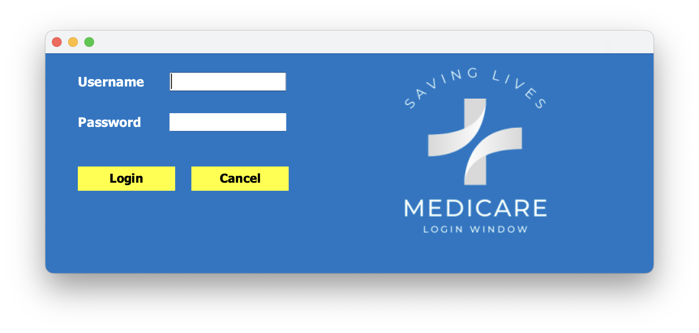
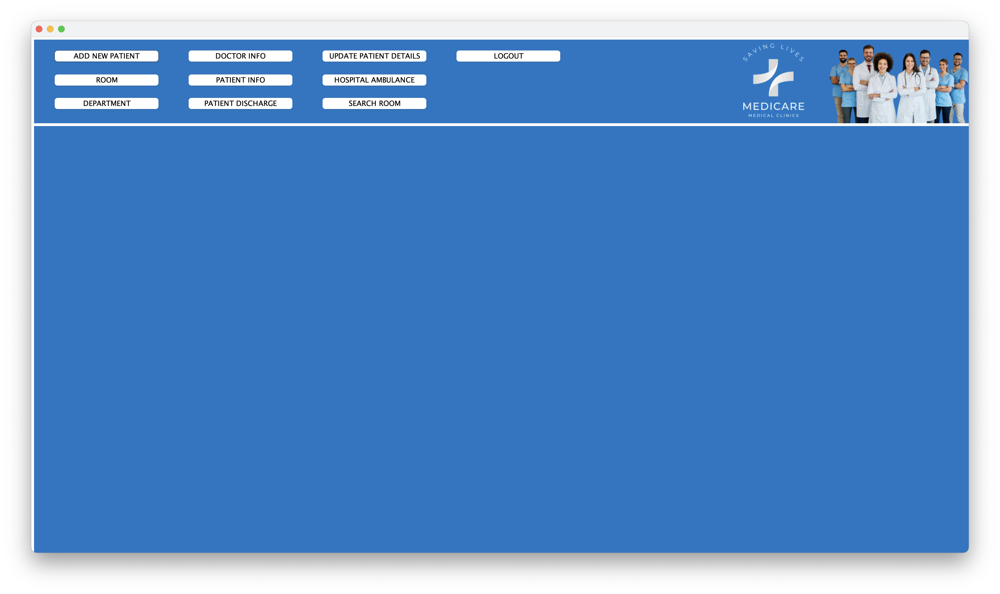

<h1>
How to use the contents of this repo:</h1>

1. Create a "Hospital Management" named folder.

        
2. Clone all the repo and put it into the folder except the MySql.

        
3. Yeah, you are almost done!!

        
For the database part:

        
1. Install the MySql database from their official website.

        
*If facing problems in installing, check some YouTube tutorials.

        
2. Make use of the default root of the MySql database.

        
3. Copy all the SQL file in MySql in the database.

        
4. Run all the queries line by line.

        
That's all, you are set.🙌

        <h3>
                Some sample images of this project!
        </h3>
  <h4>Login Window</h4>      

<h4>Reception Window</h4>

<h3>
        Any queries,no need to worry drop a mail!✉️
</h3>

